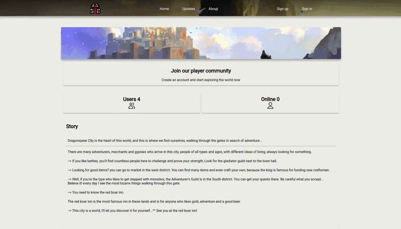

<div align="center">
    
        
    
    
    
    
       
</div>

<hr>

<h1 align="center">The Red Boar Inn - v.0.1.6</h1>


<div align="center">
   
</div>

<br>
<hr>

## About

The Red Boar Inn is a project in development that mixes RPG, MMO and the SIMPLICITY of running in any browser.

For this project I want the player to be able to interact and leave their mark on the game's history

The main idea is to allow you to create different types of gameplay choices and follow along.

This type of game is my personal choice, about what I would like to play, but it is not limited to that,
as the community grows I will accept suggestions for implementations.

<strong>"The freedom to participate in arena events, explore the world, create unique items to use or sell,
help other players fight a common enemy, or stop for a while at the tavern and have a drink with the bard."</strong>

<br>

## Story
Dragonspear City is the heart of this world, and this is where we find ourselves,
walking through the gates in search of adventure..

There are many adventurers, merchants and gypsies who arrive in this city, people of all types and ages,
with different ideas of living, always looking for something.

If you like battles, you'll find countless people here to challenge and prove your strength;

Look for the gladiator guild next to the town hall.


### Looking for good items?
you can go to market in the west district.

You can find many items and even craft your own, because the king is famous for funding new craftsmen.

Well, if you're the type who likes to get slapped with monsters, the Adventurer's Guild is in the South district.
You can get your quests there.

Be careful what you accept...

Believe it! every day I see the most bizarre things walking through this gate.


### You need to know the red boar inn.
The red boar inn is the most famous inn in these lands and is for anyone who likes gold, adventure and a good beer.

This city is a world, I'll let you discover it for yourself.
### See you at the red boar inn!

<br>


## Scope

The current scope is provided below:
...


<br>

### Install Dependencies
```
pip install -r requirements.txt
```

### Run the Migration
```
flask db init

flask db migrate
```

### Create Database
```
flask shell

app.db_sql.create_all()
```

### To Update
```
flask db upgrade

flask db migrate
```

